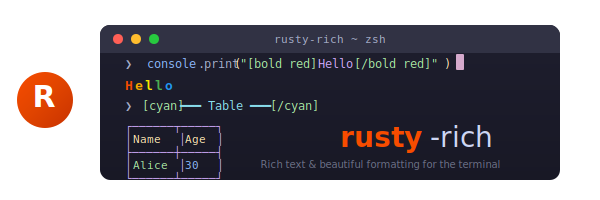

<p align="center">
  
</p>

<p align="center">
  <strong>Rich text and beautiful formatting for the terminal — a Rust port of Python's <a href="https://github.com/Textualize/rich">Rich</a> library.</strong>
</p>

<p align="center">
  <a href="https://crates.io/crates/rusty-rich"></a>
  <a href="https://docs.rs/rusty-rich"></a>
  <a href="LICENSE"></a>
  <a href="#"></a>
</p>

---

## ✨ Features

- 🎨 **Style** — foreground/background colors, bold, italic, underline, dim, blink, reverse, strikethrough
- 📝 **Console markup** — `[bold red]text[/bold red]` BBCode-like inline styling
- 📊 **Table** — tabular data with headers, footers, colspan/rowspan, column alignment, sections
- 🌲 **Tree** — hierarchical tree rendering with Unicode guides
- 📦 **Panel** — bordered containers with titles, subtitles, 17 box styles
- ➖ **Rule** — horizontal dividers with optional titles
- 📐 **Padding & Align** — CSS-style spacing and alignment helpers
- 📋 **Columns** — side-by-side layout
- 🗂️ **Layout** — recursive split-pane layout system with ratio sizing
- ⏳ **Progress** — multi-task progress bars with 7 column types, file tracking
- 🔄 **Spinner** — 36+ animated spinners with name-based lookup
- 📌 **Status** — spinner + message with in-place update
- 🔄 **Live** — auto-updating live displays with alt-screen support
- 🌈 **Syntax highlighting** — powered by syntect (100+ languages)
- 📝 **Markdown** — headings, code blocks, lists, blockquotes, links
- 📋 **JSON** — pretty-printed, syntax-highlighted output
- 🔍 **Logging** — Rich-formatted log records via the `log` crate
- 🖼️ **Box drawing** — 17 box styles (rounded, square, heavy, double, ASCII, etc.)
- 🎯 **TrueColor / 256 / Standard** color with automatic detection and downgrade
- 🖥️ **Screen / Alt-screen** — full-screen terminal applications
- ⌨️ **Prompts** — `Prompt`, `IntPrompt`, `FloatPrompt`, `Confirm`, `Select<T>`, password mode
- 🔴 **Traceback** — rich exception rendering with locals, source code, frame suppression
- 📤 **HTML & SVG export** — capture console output for the web
- 🎭 **Themes** — named style maps with stack-based inheritance

## 📦 Installation

```toml
[dependencies]
rusty-rich = "0.1"
```

## 🚀 Quick Start

```rust
use rusty_rich::{
    Console, Panel, Table, Column, Rule, Tree,
    Style, Color, AlignMethod, Padding,
};

fn main() {
    let mut console = Console::new();

    // Print with markup
    console.print_str("[bold green]Hello, [red]World![/red][/bold green]");

    // Create a panel with a title
    let panel = Panel::new("Hello inside a rounded box!")
        .title("My Panel")
        .border_style(Style::new().color(Color::parse("cyan").unwrap()));
    console.println(&panel);

    // Create a table
    let mut table = Table::new();
    table.add_column(Column::new("Name").justify(AlignMethod::Left));
    table.add_column(Column::new("Age").justify(AlignMethod::Right));
    table.add_row_str(vec!["Alice".into(), "30".into()]);
    table.add_row_str(vec!["Bob".into(), "25".into()]);
    console.println(&table);

    // Create a tree
    let mut tree = Tree::new("Root");
    tree.add("Child 1").add("Grandchild");
    tree.add("Child 2");
    console.println(&tree);

    // Draw a rule
    console.rule("Section Break", None, None, None);
}
```

## 📊 Table with Colspan & Rowspan

```rust
use rusty_rich::Table;

let mut table = Table::new().title("User Report");
table.add_column(Column::new("Name"));
table.add_column(Column::new("Details").colspan(2));  // spans 2 columns
table.add_column(Column::new("Role"));                  // skipped by colspan above

// Cell-based rows with colspan/rowspan
let row = vec![
    Cell::new("Alice"),
    Cell::new("Engineer").colspan(2),
];
table.add_row(row);
```

## ⏳ Progress Bars

```rust
use rusty_rich::Progress;
use std::thread;
use std::time::Duration;

let mut progress = Progress::new();
let task_id = progress.add_task("Downloading...", Some(100.0));

for i in 0..=100 {
    progress.update(task_id, i as f64);
    print!("\r{}", progress.render(80));
    thread::sleep(Duration::from_millis(20));
}
println!();

// Or use the `track()` convenience
let items: Vec<_> = (0..100).collect();
let tracker = progress.track(items, "Processing", None);
for item in tracker {
    // process item
}
```

## ⌨️ Interactive Prompts

```rust
use rusty_rich::{Prompt, Confirm, IntPrompt, Select};

// String input
let name = Prompt::ask_with("Enter your name").unwrap();

// Password input (masked)
let password = Prompt::new("Password").password(true).ask().unwrap();

// Confirmation
let ok = Confirm::ask_with("Continue?", true).unwrap();

// Integer with validation
let age = IntPrompt::ask_with("Enter age").unwrap();

// Pick from choices
let choice = Select::new("Pick a color")
    .add("Red", "red")
    .add("Green", "green")
    .add("Blue", "blue")
    .ask()
    .unwrap();
```

## 🔴 Rich Tracebacks

```rust
use rusty_rich::traceback;

// Install a global panic hook for rich tracebacks
traceback::install();

// Or render manually
let tb = Traceback::from_exception("MyError", "something went wrong", frames)
    .show_locals(true)
    .max_frames(5)
    .suppress(vec!["std::".into(), "core::".into()]);
```

## 🖥️ Full-Screen Apps

```rust
use rusty_rich::{Console, Screen, Live};
use std::thread;
use std::time::Duration;

let mut console = Console::new();
let mut screen = console.screen();  // enters alternate screen
screen.enter();

// Use Live for auto-updating regions
let mut live = Live::new(Panel::new("Loading...").title("Status"));
live.start();

for i in 0..=100 {
    let panel = Panel::new(format!("Progress: {}%", i))
        .title("Status");
    live.update(panel);
    thread::sleep(Duration::from_millis(50));
}

live.stop();
screen.exit();  // restores terminal
```

## 🎨 Box Styles (17 built-in)

| Style | Preview |
|---|---|
| `BOX_ROUNDED` | ╭─╮ │ │ ╰─╯ |
| `BOX_SQUARE` | ┌─┐ │ │ └─┘ |
| `BOX_HEAVY` | ┏━┓ ┃ ┃ ┗━┛ |
| `BOX_DOUBLE` | ╔═╗ ║ ║ ╚═╝ |
| `BOX_DOUBLE_EDGE` | ╔═╗ ║ │ ╚═╝ |
| `BOX_HEAVY_EDGE` | ┏━┓ ┃ │ ┗━┛ |
| `BOX_HEAVY_HEAD` | ┏━┓ ┃ ┃ └─┘ |
| `BOX_SIMPLE` | borderless with separators |
| `BOX_MINIMAL` | minimal horizontal rules |
| `BOX_ASCII` | `+--+` ASCII-safe |
| … and 7 more |

## 🎯 Color System

```rust
use rusty_rich::{Color, Style};

// Named colors
let red = Color::parse("red").unwrap();
let hot_pink = Color::parse("#FF69B4").unwrap();

// TrueColor → 8-bit → Standard auto-downgrade
let style = Style::new()
    .color(Color::parse("#FF6600").unwrap())
    .bgcolor(Color::parse("#1E1E2E").unwrap())
    .bold(true)
    .italic(true);
```

## 📂 Module Map

```
src/
├── lib.rs              # Crate root + re-exports
├── console.rs          # Central rendering engine
├── screen.rs           # Full-screen / alt-screen
├── color.rs            # TrueColor / 256 / Standard
├── style.rs            # 13 attributes + hyperlinks
├── theme.rs            # Named style maps + stack
├── segment.rs          # Styled text segment + control codes
├── text.rs             # Text with Span styling
├── cells.rs            # Unicode cell width utilities
├── measure.rs          # Width measurement protocol
├── align.rs            # Horizontal + vertical alignment
├── ratio.rs            # Proportional space distribution
├── markup.rs           # BBCode-like markup parser
├── highlighter.rs      # Regex/Repr highlighters
│
├── panel.rs            # Bordered container
├── table.rs            # Tabular data + colspan/rowspan
├── tree.rs             # Hierarchical tree
├── rule.rs             # Horizontal divider
├── padding.rs          # CSS-style padding
├── columns.rs          # Side-by-side layout
├── layout.rs           # Split-pane layout
├── box_drawing.rs      # 17 box/border styles
│
├── progress.rs         # Multi-task progress + track()
├── progress_columns.rs # 7 progress column types
├── spinner.rs          # 36+ animated spinners
├── status.rs           # Spinner + message
├── live.rs             # Auto-updating display
│
├── syntax.rs           # Syntax highlighting (syntect)
├── markdown.rs         # Markdown rendering (pulldown-cmark)
├── json.rs             # Pretty-printed JSON
├── logging.rs          # log crate integration
├── prompt.rs           # Interactive prompts
└── traceback.rs        # Rich exception tracebacks
```

## 🔬 Compared to Python Rich

| Feature | Python Rich | rusty-rich |
|---|---|---|
| Console + markup | ✅ | ✅ |
| Text / Span / Style | ✅ | ✅ |
| Table (colspan/rowspan) | ✅ | ✅ |
| Panel / Rule / Tree | ✅ | ✅ |
| Layout / Columns | ✅ | ✅ |
| Progress (7 column types) | ✅ | ✅ |
| Live / Status | ✅ | ✅ |
| Syntax highlighting | ✅ | ✅ |
| Markdown / JSON | ✅ | ✅ |
| Traceback (locals, suppress) | ✅ | ✅ |
| Screen / Alt-screen | ✅ | ✅ |
| Prompts (5 types) | ✅ | ✅ |
| 36+ Spinners | ✅ | ✅ |
| 17 Box styles | ✅ | ✅ |
| HTML / SVG export | ✅ | ✅ |
| Logging handler | ✅ | ✅ |
| Jupyter integration | ✅ | — |
| File watching | ✅ | — |
| **Overall parity** | | **~90%** |

## 🧪 Testing

```bash
cargo test                    # 171 unit tests + 7 doctests
cargo test --test battle_test # Integration / battle tests
```

## 📄 License

MIT — See [LICENSE](LICENSE) for details.

---

<p align="center">
  <sub>Inspired by <a href="https://github.com/Textualize/rich">Textualize/rich</a> — the Python library that makes terminal output beautiful.</sub>
</p>
